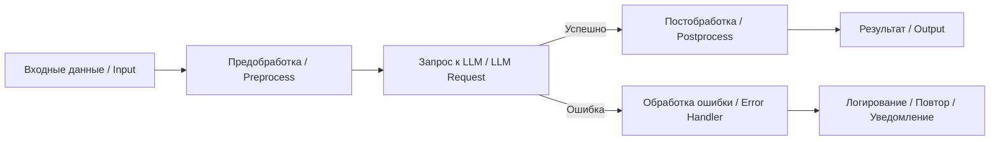

# 📊 Диаграммы и схемы AI n8n Assistant

Этот документ содержит визуальные схемы, иллюстрирующие архитектуру и логику работы проекта **AI n8n Assistant**.  
Все диаграммы выполнены в формате **Mermaid**, поддерживаемом GitHub.

---

## ⚙️ Поток данных (Data Flow)



## 🧠 Логика взаимодействия компонентов

```mermaid
flowchart TD
    user[Пользователь] -->|Запрос| wf[n8n Workflow]
    wf --> pre[Предобработка]
    pre --> llm[LLM API]
    llm --> post[Постобработка]
    post --> out[Сохранение / Вывод]
    out --> integ[Notion / Telegram / Google Sheets]
